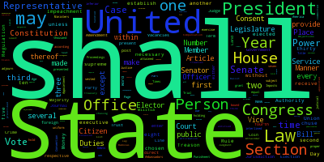
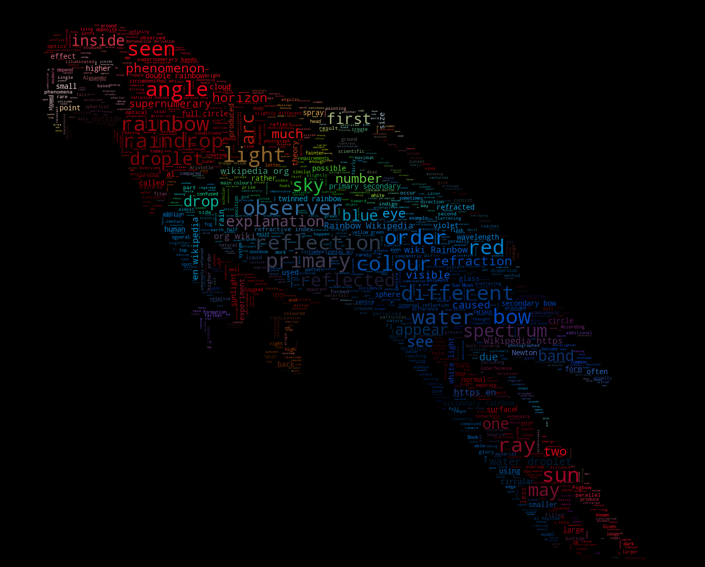

A little word cloud generator in Python.

The code is tested against Python 2.7, 3.4, 3.5, 3.6 and 3.7.

## Installation

 using pip:

    pip install wordcloud

#### Installation notes

wordcloud depends on `numpy` and `pillow`.

To save the wordcloud into a file, `matplotlib` can also be installed. See [examples](#examples) below.

If there are no wheels available for your version of python, installing the
package requires having a C compiler set up. Before installing a compiler, report
an issue describing the version of python and operating system being used.

## Examples

Check out [examples/simple.py][simple] for a short intro. A sample output is:

Or run [examples/masked.py][masked] to see more options. A sample output is:

Getting fancy with some colors:
